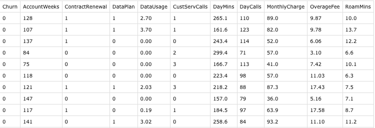

# Predicting Customer Churn 

In this project I try to build a logistic regression based model to predict whether the customer will churn out of telecom service or not.

Customer attrition is a big issue in any industry. Not surprisingly, one of the major focus of a data scientist is to reduce customer attrition and increase customer retention. It is relatively easier to predict and detect in the industries where monthly billing service exists Eg: telecom, internet, streaming service etc. From an organizational perspective, it is always cheaper to retain existing customer than to spend money to acquire new customer.

In this post, my focus is to try and build a simple model to predict whether a customer will churn or not given a dataset.

**Dataset**

This dataset has total 11 columns including a column called churn which is our dependent variable, and 10 columns which are our predictor variables.

We will try and identify the variables which are significant in predicting customer churn and try to build a logistic regression model which will accurately predict the churn.

All the steps taken are outlined in [my blog post here](https://gaurang.swarge.com/blog/predicting-customer-churn-in-telecom-industry).

All the code in the R file, should be self explanatory.

